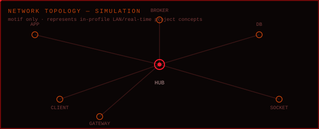

<div align="center">

```
███╗   ███╗ ██████╗ ██╗   ██╗██╗     ██╗  ██╗██╗  ██╗██╗██████╗ ██████╗  █████╗
████╗ ████║██╔═══██╗██║   ██║██║     ██║ ██╔╝██║  ██║██║██╔══██╗██╔══██╗██╔══██╗
██╔████╔██║██║   ██║██║   ██║██║     █████╔╝ ███████║██║██████╔╝██████╔╝███████║
██║╚██╔╝██║██║   ██║██║   ██║██║     ██╔═██╗ ██╔══██║██║██╔══██╗██╔══██╗██╔══██║
██║ ╚═╝ ██║╚██████╔╝╚██████╔╝███████╗██║  ██╗██║  ██║██║██████╔╝██║  ██║██║  ██║
╚═╝     ╚═╝ ╚═════╝  ╚═════╝ ╚══════╝╚═╝  ╚═╝╚═╝  ╚═╝╚═╝╚═════╝ ╚═╝  ╚═╝╚═╝  ╚═╝

```

[](https://github.com/moulkhibra)

[](https://github.com/moulkhibra)

</div>

<!-- Easter egg — author note: every claim on this profile maps to a public
     repository. No credentials are fabricated. Nothing here is a trophy wall. -->
<!-- 65 41 53 54 45 52  45 47 47  3A  20 6C 65 61 72 6E 20 73 6C 6F 77 2C  62 75 69 6C 64  73 74 65 61 64 79 -->

> **MOULKHIBRA** — self-taught security researcher **in training** · builder · 1337/42 piscine student.
> This profile documents **what is built** and **what is being studied**. Every claim below maps to a public repository you can open.

---

## 0x00 · SYSTEM IDENTITY

```text
NAME     : Amine Erresmy
ALIAS    : moulkhibra
FOCUS    : security research · web security · OSINT · tooling
LOCATION : Morocco (remote-friendly)
SCHOOL   : 1337 / 42 Network piscine (POOL1337) — C & shell foundations
STATUS   : ● ACTIVE — building, documenting, studying
```

## 0x01 · MISSION & BOUNDARY

Three lanes, kept deliberately separate so nothing is mislabeled:

- **SECURITY LEARNING** — C foundations, web-security defence shipped in real apps, OSINT/recon study
- **SOFTWARE ENGINEERING** — management systems, real-time applications, dashboards
- **TAEKWONDO DOMAIN APPS** — tools for the sport I train

> Boundary: everything labeled **IN PROGRESS / STUDYING** is intentional learning on local labs and authorized targets only —
> not claims of certifications, engagements, or bug-bounty rewards.

[](https://github.com/moulkhibra)

---

## 0x02 · TECHNICAL ARSENAL

Markers: `●` applied in repositories · `○` actively studying. No fake percentages — capability is proven by code, not bars.

| Area | Stack | Status |
|---|---|---|
| Languages | Python · C · JavaScript (Node) · Bash · SQL | `●` in repo code |
| Web (backend) | Flask · SQLAlchemy · WTForms · Socket.IO | `●` taekwondo-tournament · 7ofra |
| Web (frontend) | React · Vite · Tailwind · i18next | `●` taekwondo-app · INTRA-TKD |
| Desktop | Python + Tkinter · SQLite | `●` SMTN *(documented)* |
| Systems | Linux daily driver · Git · (Kali: study) | `●` / `○` |
| Data | SQLite · Firestore · openpyxl (Excel) | `●` |
| Security | PBKDF2 hashing · RBAC · CSRF/XSS defence · Firestore rules | `●` in repos |
| OSINT / Recon | footprinting · passive collection · written analysis | `○` study + labs |

## 0x03 · SECURITY MODULES

Security work actually shipped in this profile's code:

- **taekwondo-tournament** — PBKDF2 password hashing (Werkzeug) · role-based access · CSRF guard (Flask-WTF) · Jinja autoescape
- **INTRA-TKD** — Firebase Auth · Firestore security rules (role-scoped) · env-driven Firebase config
- **7ofra** — real-time LAN protocol implementation (Node · Socket.IO)
- **This profile** — GitHub Actions workflow for the contribution grid

`○` Studying next: OWASP Top 10 methodology, network packet analysis, CTF challenges, exploit documentation.

---

## 0x04 · CASE FILES

```text
┌──────────────────────────────────────────────┐
│ [ CASE 0x01 ]  ▟  POOL1337                   │
├──────────────────────────────────────────────┤
│ CLASS    : education — 1337 (42 Network)     │
│ PURPOSE  : C & shell fundamentals            │
│ STACK    : C · Bash · Shell · Git            │
│ STATUS   : ● c00–c13 · shell00/01 · rush00   │
│ DID      : memory, pointers, algorithms,     │
│            Makefile, recursion, linked lists │
└──────────────────────────────────────────────┘
```
[](https://github.com/moulkhibra/POOL1337)

---

## 0x05 · ENGINEERING LAB

```text
┌──────────────────────────────────────────────┐
│ [ LAB 0x02 ]  ▟  taekwondo-tournament        │
├──────────────────────────────────────────────┤
│ CLASS    : application — tournament engine   │
│ PURPOSE  : Kyourgi & Poomsae tournaments     │
│ STACK    : Python · Flask · SQLAlchemy       │
│ STATUS   : ● functional prototype            │
│ CORE     : Qor3a fair-draw + BYE brackets    │
│ SECURITY : PBKDF2 · RBAC · CSRF · autoescape │
└──────────────────────────────────────────────┘
```

[](https://github.com/moulkhibra/taekwondo-tournament)

```text
┌──────────────────────────────────────────────┐
│ [ LAB 0x03 ]  ▟  INTRA-TKD                   │
├──────────────────────────────────────────────┤
│ CLASS    : application — club management     │
│ PURPOSE  : students · payments · attendance  │
│ STACK    : React · Firebase · Tailwind       │
│ STATUS   : ● in development (real codebase)  │
│ EXTRA    : QR attendance · ID cards · PWA    │
└──────────────────────────────────────────────┘
```

[](https://github.com/moulkhibra/INTRA-TKD)

```text
┌──────────────────────────────────────────────┐
│ [ LAB 0x04 ]  ▟  taekwondo-app               │
├──────────────────────────────────────────────┤
│ CLASS    : application — club dashboard      │
│ PURPOSE  : Arabic RTL club management        │
│ STACK    : React 18 · Vite · Tailwind        │
│ STATUS   : ● in development                  │
│ FEATURES : students · classes · tournaments  │
│            · i18n (ar/en)                    │
└──────────────────────────────────────────────┘
```

[](https://github.com/moulkhibra/taekwondo-app)

---

## 0x06 · PROJECTS — STATUS REQUIRES REVIEW

```text
┌──────────────────────────────────────────────┐
│ [ FILE 0x03 ]  ▟  SMTN                       │
├──────────────────────────────────────────────┤
│ CLASS    : application — school management   │
│ PURPOSE  : desktop admin (users, grades,     │
│            finance, attendance)              │
│ STACK    : Python · Tkinter · SQLite (doc'd) │
│ STATUS   : ⚠ DOCUMENTED — full source not    │
│            yet published in this repository  │
└──────────────────────────────────────────────┘
```

> **Honest status:** the SMTN repo contains documentation, the entry point and a demo database — the working `src/` modules
> are **not yet committed**. `main.py` currently imports modules that are absent from the repository.
> The profile lists it accurately as *documented, source pending*.

[](https://github.com/moulkhibra/SMTN)

---

## 0x07 · NETWORK & REAL-TIME LAB

```text
┌──────────────────────────────────────────────┐
│ [ LAB 0x05 ]  ▟  7ofra                       │
├──────────────────────────────────────────────┤
│ CLASS    : application — LAN real-time chat  │
│ PURPOSE  : local-network rooms + reactions   │
│ STACK    : Node.js · Express · Socket.IO     │
│ STATUS   : ● prototype — runs locally (LAN)  │
│ NOTE     : stale `.env` key being sanitized  │
│            (audit finding, tracked fix)      │
└──────────────────────────────────────────────┘
```

[](https://github.com/moulkhibra/7ofra)

```text
┌──────────────────────────────────────────────┐
│ [ LAB 0x06 ]  ▟  moulkhibra.github.io        │
├──────────────────────────────────────────────┤
│ CLASS    : web — cinematic cybersecurity UI   │
│ PURPOSE  : interactive scrollytelling demo    │
│ STACK    : Three.js · WebGL · Vite · GSAP     │
│ STATUS   : ● LIVE — moulkhibra.github.io     │
│ NOTE     : simulated persona, clearly labeled │
└──────────────────────────────────────────────┘
```

[](https://github.com/moulkhibra/moulkhibra.github.io)
[](https://moulkhibra.github.io)

---

## 0x08 · INVESTIGATION / TELEMETRY

[](https://github.com/moulkhibra)

[](https://github.com/moulkhibra)

<div align="center">

[](https://github.com/moulkhibra)

[](https://github.com/moulkhibra)

[](https://git.io/streak-stats)


</div>

> If a widget fails to load, live activity is on [github.com/moulkhibra](https://github.com/moulkhibra).

---

## 0x09 · SECURE CHANNEL

<div align="center">

[](https://github.com/moulkhibra)
[](https://moulkhibra.github.io)

</div>

Only verified public channels are listed. Direct contact via GitHub issues is preferred.

---

<div align="center">

```text
             ██████████████████████████████████████
             ██  ⚠  FOR AUTHORIZED TESTING ONLY  ⚠ ║
             ██████████████████████████████████████
```

<sub>MOULKHIBRA · security research lab · Morocco · 1337/42 network · every claim maps to a repository</sub>

</div>
